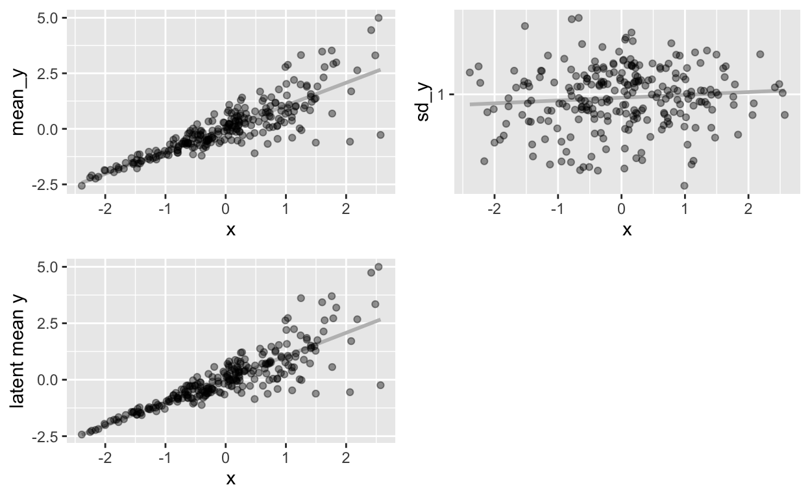

```{r setup, include=FALSE}
knitr::opts_chunk$set(echo = FALSE, cache = TRUE)
```

```{r}
library(tidyverse)
library(brms)
library(tidybayes)
options(mc.cores = parallel::detectCores(),
        brms.backend = "cmdstanr",
        brms.file_refit = "on_change")

theme_set(theme_bw())
```

Recently, I got mad at a ceiling.


```{r}
library(tweetrmd)
tweet_embed("https://twitter.com/rubenarslan/status/1632170569448685569")
```

Let me explain. [Kahneman & Deaton (2010)](https://pnas.org/doi/full/10.1073/pnas.1011492107) reported that happiness plateaued at an income of $75,000 or higher. Their measure of happiness was a binary question that a 1000 people answered ~450 times each over the course of a year. [Killingsworth 2021](https://pnas.org/doi/full/10.1073/pnas.2016976118) used his experience sampling data from more than 35,000 individuals responding ~50 times to refute this. The Killingsworth study had a better happiness measure, a sliding scale from very unhappy to very happy. He found a loglinear relationship across the entire income range^[so, a doubling of income is associated with same happiness increment throughout the income range]. He attributed Kahneman & Deaton's (2010) plateau finding to a ceiling effect in their measure. 

Now, in a recent paper, [Killingsworth, Kahneman, and Meller (2023)](https://www.pnas.org/doi/10.1073/pnas.2208661120) re-analyzed Killingsworth's (2021) experience sampling data to determine the relationship between income and experienced well-being, happiness. In the reanalysis, KKM wanted to find out why the results differed in an "adversarial collaboration". 

To do so, they aggregated daily happiness in the Killingsworth data to derive the subject's observed mean. Then they used a form of distributional regression, quantile regression, to predict not only the mean of happiness but also various quantiles by `log(income)`. Specifically, they investigated whether the relationship to the mean plateaued above a yearly household income of $100,000. This was not the case, the relationship between income and mean happiness is loglinear above and below this threshold with near-identical slopes. It's also a quite small relationship, `log(income)` explains less than 1% of the variance in happiness.

However, they find that the relationship between `log(income)` and the 15% quantile does indeed flatten after $100,000. In my view, they inappropriately interpret this as evidence that there is an unhappy group of people for which money cannot alleviate suffering (above 100k).

A better way to put it would have been: at higher `log(income)` the variability in average happiness is higher. That is, some people have a lot of money and spend it on holidays, household help, and time with their loved ones. Others buy a social media platform and make themselves miserable. But even if this statistical relationship is real^[Big if!] and reflects a causal relationship^[Even bigger if!], it does not imply that there is one group of people whose unhappiness cannot be alleviated with money.

Now, I'm not particularly well-acquainted with quantile regression. However, I've worked with multilevel location scale models a good deal in the past, a different form of distributional regression. In so doing, I've learned not to trust my intuition, or at least to calibrate with fake data simulation. So, I simulated to check a hunch.


### Two questionable assumptions in the quantile regression
My conclusion is that KKM make at least two^[two assumptions that I'll touch on here. They do not make their assumptions regarding causal inference explicit, but still very much imply causality. But, like, what else is new?] assumptions that I think are unlikely to hold and which could bias their estimate:

1. that the variance of happiness within-subjects is homogeneous
2. that their aggregated means of happiness are free of sampling error

I was fairly sure that #1 is false, because, you know, I've seen happiness data, and because I am a human being who knows other human beings. I did not see their happiness data, mind you, which they only shared in aggregated and rounded form upon publication of KKM 2023, so we cannot check within-subject variance homogeneity.^[I requested the raw data on March 4.]

I was less sure whether #2 has much impact with 51 days per subject on average. 

### Simulation results

- Even with on average 51 days per subject and homogeneous within-subject variance, sampling error in the mean attenuates the relationship between `x` and `sd(y)` on the between-subject level. Especially at low levels of x, sampling error can still dominate the true `sd(id)` in `y`.

```{r fig.cap="Compare the scatter of y around the regression line at the top left and the bottom left to see how sampling error creates a slight bias when estimating the effect on sd(y) on the between-subject level. From the second simulation below."}

```

```{r fig.cap="A between-subject effect on the log(sd) of .8 reduces to .65 because of sampling variance in aggregated means."}
knitr::include_graphics("multilevel-censored-location-scale-models_files/figure-html5/BS_0_8_WS_0__rmdpartial-30-1.png")
```


- Heterogeneous within-subject variance can bias the estimate of the between-subject variance (i.e., what is really a strong tendency for an increased within-subject variance at higher `x` is mistaken for a weak tendency for an increase in between-subject variance at higher `x`).

```{r fig.cap="A within-subject effect on the log(sd) of .8 shows up as a .2 effect on the between-subject level."}
knitr::include_graphics("multilevel-censored-location-scale-models_files/figure-html5/BS_0_WS_0_8_rmdpartial-16-1.png")
```

- Censoring increases bias. When values above or below a certain cutoff (e.g., the maximum value of the scale is 100) get clipped, the bias in the aggregated between-subject model is exacerbated. Why? The aggregation is done without regard to censoring. So, a person with `c(94, 95, 96, 95)` gets 95, just like a person with `c(90, 100, 100, 90)`. But if we model censoring at the within-subject level, we would estimate a higher true value for the second person (my 2-part model correctly recovers the true value). Killingsworth 2021 reports only 5.5% of responses at ceiling and the relationship with the mean is quite weak, so this probably did not hit hard. Still, aggregating loses relevant information (after aggregation "less than 0.5% of people in any income group had experienced well-being equal to the response ceiling, on average").


```{r fig.cap="The true between-subject effect on the log(sd) is underestimated more (~.55 with censoring vs. .65 without censoring vis a vis a true value of .8), even though just 10% of values are right-censored."}
knitr::include_graphics("multilevel-censored-location-scale-models_files/figure-html5/BS_0_8_WS_0_2_rmdpartial-48-1.png")
```

```{r fig.cap="The between-subject effect on the log(sd) is overestimated  more (~.3 censored vs. .16 non-censored vis a vis a true value of 0) in the censored within-subject model, even though just 12% of values are censored."}
knitr::include_graphics("multilevel-censored-location-scale-models_files/figure-html5/BS_0_WS_0_8_2_rmdpartial-39-1.png")
```

<!-- - Not a concern for KKM, but for one of my projects: at 51 days per person, there's minimal bias from between-subject to within-subject (i.e. mistaking a between-subject increase in scale for a within-subject increase in scale). At smaller ns this can happen, but it's not much. The bias occurs because the means are estimated to lie on a normal distribution with a constant standard deviation across `x`. -->


__Technical note:__ There are Mplus (McNeish, 2020) and R-Stan ([Martin, 2022](https://cran.r-project.org/web/packages/LMMELSM/index.html)) models to estimate two-part mixed effects location-scale models that allow simultaneous estimation of scale effects at both the within- and between-subject level. However, they do not implement censored distributions. My favourite package `brms` does, but does not natively permit scale effects on the between-subject level to be estimated. However, it allows us to estimate different `sd(id)` for subgroups. I formed septiles on x and used these as subgroups. Doing so allowed me to get a sort of poor man's version of a censored two-part mixed effects location-scale model. A better man would have coded it up in raw Stan. As far as I can tell, this model both gets me closer to the between-subject effect than the aggregated model and gets me an unbiased estimate of the within-subject effect.


```{r fig.cap="Regressing x on the estimated sd(y) for the quantiles in my two-part model recovers the true between-subject effect even in the censored model."}
knitr::include_graphics("multilevel-censored-location-scale-models_files/figure-html5/BS_0_8_WS_0_2_rmdpartial-49-1.png")
```

You can find my simulations (well, one round) below.

## Lessons learned
In German, we of course have a word for this: Verschlimmbesserung.^[My dictionary says "disimprovement". Is that actually in use?] Killingsworth 2021 was a wonderful paper. I think this quantile analysis and adversarial collaboration actually muddled the matter. How come?

I have an idea. Adversarial collaborations don't just sound like an oxymoron. Especially with large status differences between adversaries, the interesting stuff happens behind the scenes. Without transparency, power, resources, and stubbornness can win over superior arguments.^[Am I projecting based on my own attempt at adversarial collaboration? Absolutely! Thanks for asking, I'm okay!] I think such disputes should be carried out in the open. And if you want to share data with someone you consider an adversary, may I suggest the following as insurance:


```{r}
library(tweetrmd)
tweet_embed("https://twitter.com/rubenarslan/status/1631789472407859200")
```

<!-- <details><summary>Simulations</summary> -->

## Simulations

### Location-scale within-subject
Here, mu(y) is a function of x, as is sigma(y) (only at the within-subject level).

```{r}
fit_models <- function(b_mean,  b_sd_bs, b_sd_ws, y_ceiling) {
  name = paste("BS", b_sd_bs, "WS", b_sd_ws, if_else(y_ceiling<Inf,as.character(y_ceiling),""))
  rmdpartials::partial("fit_models.Rmd", 
                       name = name,
                       b_mean = b_mean,  
                       b_sd_bs = b_sd_bs, 
                       b_sd_ws = b_sd_ws, 
                       y_ceiling = y_ceiling)
}
```

```{r}
fit_models(b_mean = 1,  b_sd_bs = 0, b_sd_ws = 0.8, y_ceiling = Inf)
```


### Location-scale between-subject
Here, mu(y) is a function of x, as is sigma(y) at the between-subject level.


```{r}
fit_models(b_mean = 1,  b_sd_bs = 0.8, b_sd_ws = 0, y_ceiling = Inf)
```


```{r}
# remotes::install_github("stephensrmmartin/LMMELSM")
# library(LMMELSM)
# m_melsm_2part <- lmmelsm(list(observed ~ y,
#                     location ~ x,
#                     scale ~ x,
#                     between ~ x),
#                id, days)
# summary(m_melsm_2part)
```

### Censored location-scale within-subject
Here, mu(y) is a function of x, as is sigma(y) (only at the within-subject level).

```{r}
fit_models(b_mean = 1,  b_sd_bs = 0, b_sd_ws = 0.8, y_ceiling = 2)
```

### Censored location-scale between-subject
Here, mu(y) is a function of x, as is sigma(y) only at the between-subject level.

```{r}
fit_models(b_mean = 1,  b_sd_bs = 0.8, b_sd_ws = 0, y_ceiling = 2)
```


<!-- </details> -->
