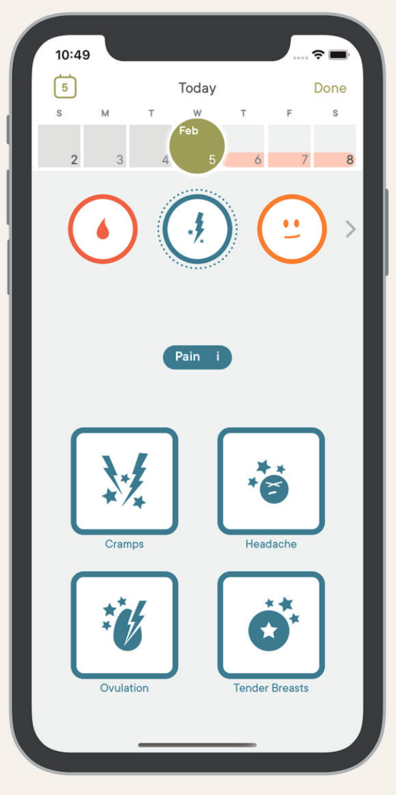

NEW IDEA:
- model predicts FP at day level
- diff model with agg preds predicts FP at cycle/user level
- estimate FPs
- model-based rates
- true_rate = obs_rate - FPs + obs_rate * FPs


If you've seen me talk at a conference in recent years, you know that I have been working with data collected by the cycle tracking app [Clue](https://helloclue.com).

The cool thing about this dataset is that it's __a)__ big __b)__ highly repeated (daily tracking) __c)__ spans long time frames (for some users, years).

The not so cool thing is that all outcomes are tracked using single on-off button for each outcome. No multiple items, no Likert scales, not even a way to tell a nonresponse from a no.
Still, the amount of data, in my view, can more than compensate for this problem, and I find very similar results on e.g. sexual desire as in my other work, which hopefully does better psychometrically but falls way short of Clue's sample size.

Another problem that I have been grappling with is that there seems to be a nonzero rate of misclicking in the app. I don't know whether this sort of problem is more common in daily app data, whether it has to do with the design of the app interface, or whether I would normally simply not have the amount of data to see the false positives.

The question I'm trying to answer is to estimate the rate of _mittelschmerz_, i.e.
how many women ever experience mittelschmerz and/or in how many cycles mittelschmerz
is experienced. Mittelschmerz is a pain that occurs around ovulation, i.e. in the middle of the cycle. Mittelschmerz should not occur during (pre-)menstruation. Nor should people who take combined oral contraceptive pills be ovulating especially frequently. Yet, I observe both of these things. Why?

I suspect the interface. In Clue, symptom buttons are thematically arranged. As you can see, the "ovulation pain" button is next to the button for cramps and tender breasts. Guess which forms of pain do occur during (pre-)menstruation and for people on the pill. That's right, cramps and breast tenderness.

<aside></aside>

So, I think that in some non-zero percent of cases, users will accidentally turn on the "ovulation pain" button instead of or along with the "cramps" and "tender breasts" button.

Here, let me simulate that real quick:

```{r, echo=T, warning = F}
set.seed(05102019)
library(tidyverse)
reps = 10000
days <- 30
logit <- boot::logit
miss_prob <- 0
daily <- tibble(
  # users
  id = rep(1:reps, each = 30),
  # cycle days
  time = rep(1:days, times = reps),
  ovulating = c(rep(1, times = 30 * 0.75 * reps), 
                rep(0, times = 30 * 0.25 * reps)),
  feel_ms = c(rep(1, times = 30 * 0.25 * reps), 
                rep(0, times = 30 * 0.75 * reps)),
  ovulation_day = rep(round(rnorm(reps, 15, sd = 1.5)), each = 30),
  cs = 1 * rbinom(reps * days, 1, 
                  plogis(-5 + 1 * if_else(time < 6, 5-time, 0))),
  os = if_else(time == ovulation_day & ovulating & feel_ms, 1, 0),
  c_clicks = rbinom(reps * days, 1, prob = (1 - miss_prob) * cs),
  o_clicks = rbinom(reps * days, 1, prob = 
                      plogis(-4 + 3 * cs + 10 * os))) %>% 
  mutate(time = factor(time))

# readr::write_csv(daily, "daily.csv")
# daily %>% group_by(time) %>% summarise_all(mean) %>% View
# daily %>% group_by(time) %>% summarise(sprintf("%.7f",mean(o_clicks))) %>% View
```

As you can see, I've simulated an effect of time on the variable cs 
For a subset of ids, there is one ovulation per cycle, sometime
in the middle, which causes os. The true rate is `1/4 * 1/30` = `r sprintf("%.5f", 1/4 * 1/30)`, i.e. a fourth of people feel ovulation on one day per cycle.


```{r}
library(marginaleffects)
glm1 <- glm(os ~ 1, data = daily, family = gaussian)
predictions(glm1)[1,]
```


In the next step, I've modelled clicks on these buttons. People hit their button of
choice with a 95% accuracy. But there's a 20% chance of fat thumbs hitting the `o` button when aiming for `b` or `c`.

So, while o truly peaks in the middle, we actually see additional
peaks at either end of the cycle in the observed clicks.

```{r}
ggplot(daily %>% pivot_longer(c(cs:os,c_clicks, o_clicks, -time)) %>% 
         mutate(clicks = if_else(str_detect(name, "clicks"), 
                                 "observed", "true"),
                name = str_sub(name, 1, 1)), aes(time)) +
  geom_point(aes(y = value, color = name), stat = 'summary') +
  facet_wrap(~ clicks) +
  scale_x_discrete(breaks = c(1, 5, 10, 15, 20, 25, 30)) +
  theme_bw()
```

Now, how do I get rid of this bias? Here's an idea: 
I find a ~pure false positive subset to estimate the relationship of false positives to my predictors.
In my real data, these would be cycle days during (pre-)menstruation for users of the combined oral contraceptive pill. In my simulations, I subset in a similar way and then fit a general linear model.


```{r}
ggplot(daily %>% filter(ovulating == 0) %>% 
         pivot_longer(c(cs:os,c_clicks, o_clicks, -time)) %>% 
         mutate(clicks = if_else(str_detect(name, "clicks"), 
                                 "observed", "true"),
                name = str_sub(name, 1, 1)), aes(time)) +
  geom_point(aes(y = value, color = name), stat = 'summary') +
  facet_wrap(~ clicks) +
  scale_x_discrete(breaks = c(1, 5, 10, 15, 20, 25, 30)) +
  theme_bw()
```


```{r}
library(marginaleffects)
glm2 <- glm(o_clicks ~ 1 + c_clicks, data = daily %>% 
                      filter(!ovulating, ! time %in% 10:20 ), family = binomial)
```


Now, I can compute the rate before and after setting my predictors to zero.

```{r}
avg_predictions(glm2)
avg_predictions(glm2, newdata = tibble(c_clicks = 0))
```

This is very close to `plogis(-4)` ~= `r sprintf("%.3f",plogis(-4))`, i.e. the false positive intercept I added in my simulation above.

I can estimate the rate of false positives per day in all of the data, including data where there should be true positives.

```{r}
daily$fp <- predict(glm2, newdata = daily, type = "response")
mean(daily$fp,na.rm=T)
```


To estimate the true rate, I subtract the false positive rate.
I can also divide by (1-FP) to account for clicks which were both intended and
accidental. However, in Clue, if a button is clicked twice, it would be unchecked. However,
my mental model of how this happens is that users don't feel mittelschmerz accidentally check the button
but don't bother to correct it. Users who do feel mittelschmerz will pay more attention to make sure the button is in the desired state.

```{r}
glm5 <- glm(o_clicks ~ 1, data = daily, family = binomial)
daily$obs_rate <- predict(glm5, type = "response")
daily %>% 
  summarise(obs_rate = mean(obs_rate), fp_rate = mean(fp)) %>% 
  mutate(
    est_true_rate = (obs_rate - fp_rate),
    est_true_rate_uncheck = (obs_rate - fp_rate) / (1 - fp_rate)
    )
```


Let's bring the time variable back in. The black line is the true curve.

```{r}
glm7 <- glm(o_clicks ~ time, data = daily, family = binomial)
daily$obs_rate <- predict(glm7, type = "response")
daily %>% 
  group_by(time) %>% 
  summarise(obs_rate = mean(obs_rate), fp_rate = mean(fp)) %>% 
  mutate(
    est_true_rate = (obs_rate - fp_rate),
    est_true_rate_uncheck = (obs_rate - fp_rate) / (1 - fp_rate)
    ) %>% 
  mutate(est_true_rate = if_else(est_true_rate < 0, 0, est_true_rate),
         est_true_rate_uncheck = if_else(est_true_rate_uncheck < 0, 0, est_true_rate_uncheck)
         ) %>% 
  pivot_longer(c(-time)) %>% 
  ggplot(aes(time, value, color = name)) +
  geom_line(aes(time, os, group = 1),color = "black", stat = "summary", data = daily) +
  geom_point(position = position_dodge(width = 0.4)) +
  theme_bw() +
  scale_color_brewer(type = 'qual', palette = 2)
```


In the real example, I'm interested in estimating how many women __ever__ experience mittelschmerz. So, I also wanted to estimate false positives at the cycle and user level. For simplication, I just consider user/cycle as one thing here. The strategy remains the same: focus on the (pre-)menstruation period for users who are not ovulating to estimate the false positive rate. Extrapolate it to the rest of the users. Then compute the true rate from the observed rate.

Complications: 

1. I had to implement an offset to correctly estimate the FP rate from the shorter cycles (after excluding the midcycle period).
2. I had to use the sum score of `c_clicks` as a predictor, instead of the mean (so that it would scale with the observation period)

```{r}
no_o_users <- daily %>% 
  filter(!feel_ms, !time %in% 10:20) %>% 
  group_by(id, feel_ms) %>% 
  summarise(fp_daily = mean(fp),
            any_o_clicks = if_else(any(o_clicks == 1), 1, 0),
            days = n(),
            o_clicks = sum(o_clicks),
            c_clicks = sum(c_clicks))

users <- daily %>% group_by(id, feel_ms) %>% 
  summarise(fp_daily = mean(fp),
            any_o_clicks = if_else(any(o_clicks == 1), 1, 0),
            days = n(),
            o_clicks = sum(o_clicks), 
            c_clicks = sum(c_clicks))

glm9 <- glm(any_o_clicks ~ 1 + c_clicks + offset(log(days)), data = no_o_users, family = binomial())
avg_predictions(glm9)
(fp_rate <- avg_predictions(glm9, newdata = tibble(days = 30, c_clicks = mean(users$c_clicks)))[,"estimate"])


users$fp_users <- predict(glm9, newdata = users, type = "response")
glm10 <- glm(any_o_clicks ~ 1 + offset(log(days)), data = users, family = binomial())
obs_rate <- avg_predictions(glm10, newdata = tibble(days = 30, c_clicks = mean(no_o_users$c_clicks)))[,"estimate"]

mean(users$fp_users,na.rm=T)
fp_rate <- mean(users$fp_users)
(mean(users$any_o_clicks) - fp_rate)/(1- fp_rate)
```

Looks good! Now I'll try my approach on the real data, to be inevitably disappointed.

## Appendix {.appendix}

I first tried to use offsets in binomial regressions to fit my generative model. But I ran into trouble setting this up. Also, in both cases, I have to use `log(fp)` as the offset which implies that setting `fp=0` in my marginal effects yields `-Inf`. This doesn't seem right and I gave up on this. If you're interested, the code follows.

I can then use the estimated rate of false positives as an offset (a regression coefficient whose slope has been fixed to 1).

```{r}
knitr::opts_chunk$set(eval = F)
```

```{r}
glm5 <- glm(o_clicks ~ offset((fp)), data = daily)
glm5 <- glm(o_clicks ~ offset(log(fp)), data = daily, family = binomial(link = "cloglog"))
glm5 <- glm(o_clicks - fp ~ 1, data = daily)
avg_predictions(glm5)
avg_predictions(glm5, newdata = tibble(fp = 0.01))
mean(daily$o_clicks)-mean(daily$fp)
```

This is still higher than the true value of .008, but closer.

Let's bring the time variable back in.

```{r}
glm7 <- glm(o_clicks ~ time, data = daily, family = binomial)
glm8 <- glm(o_clicks ~ time + offset(log(fp)), data = daily, family = binomial)
bind_rows(
  no_offset = predictions(glm7, newdata = tibble(time = factor(1:30))),
  offset = predictions(glm8, newdata = tibble(time = factor(1:30),
                                              fp = 0.01)),
  .id = 'model') %>%
  ggplot(aes(time, estimate, color = model)) +
  geom_line(aes(time, os, group = 1),color = "black", stat = "summary", data = daily) +
  geom_point(position = position_dodge(width = 0.4)) +
  theme_bw() +
  scale_color_brewer(type = 'qual')
```

After taking the offset into account, the peaks near the end disappear. I'm pretty satisfied with this.


In the real example, I'm interested in estimating how many women __ever__ experience mittelschmerz. So, I a) want to implement a false positive model at the daily level b) estimate rates of _any_ mittelschmerz per cycle and c) per _user_. Especially for c) I'd like to specify a model that takes the number of cycles into account (since I'm more likely to observe a cycle with mittelschmerz, the more cycles I have for the user). I have this all set up, but I'm struggling with implementing a false positive model using lme4. It sort of works with brms, but that's a poor fit for the huge sample size I'm working with. Also, in both cases, I have to use `log(fp)` as the offset which implies that setting `fp=0` in my marginal effects yields `-Inf`. This doesn't seem right.

At this point, I'm wondering whether the approach via `offset` is silly, but I don't really have an alternative idea.

Using lme4

```{r error = T}
library(lme4)
# https://stats.stackexchange.com/questions/88960/lme4-glmer-problems-with-offset
#
glm9 <- glmer(o_clicks ~ time + (1|id), data = daily, family = binomial())
glm10 <- glmer(o_clicks ~ time + offset(log(fp)) + (1|id), data = daily,
               family = binomial(link="cloglog")) # does not work
glm10 <- glmer(o_clicks ~ time + log(fp) + (1|id), data = daily,
               family = binomial(link="cloglog")) # works and estimate the slope as 1, so why does the other model not work

bind_rows(
  no_offset = predictions(glm9, newdata = tibble(time = factor(1:30)),
                          re.form = NA),
  offset = predictions(glm10, newdata = tibble(time = factor(1:30),
                                              fp = 0.01), re.form = NA),
  .id = 'model') %>%
  ggplot(aes(time, estimate, color = model)) +
  geom_point(position = position_dodge(width = 0.4)) +
  theme_bw() +
  scale_color_brewer(type = 'qual')
```

