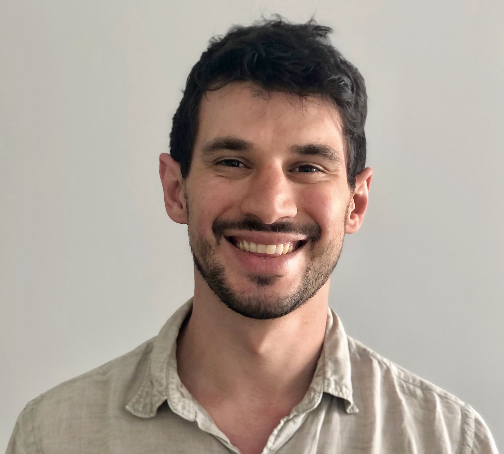

```{r setup, include=FALSE}
knitr::opts_chunk$set(echo = FALSE)
```

I study genetic and hormonal causes of why people differ and change, especially their personality, intelligence, and sexuality. Open, reproducible science is important to me, so I focus on methods, measures, and transparency and dabble in research software development. I live in Berlin and work at the [University of Leipzig](https://www.lw.uni-leipzig.de/institut-fuer-psychologie-wilhelm-wundt/arbeitsgruppen/persoenlichkeitspsychologie-und-psychologische-diagnostik/team/dr-ruben-arslan-lennartz/). 

<aside>

</aside>

You can reach me at ruben.arslan@gmail.com or on [Twitter](https://twitter.com/rubenarslan). If you want to tell me I'm wrong about something anonymously, you can use [this form](https://tellmeimwrong.formr.org).^[Some more information about this form can be found [here](http://www.the100.ci/2018/02/22/tell-me-im-wrong).] I also have a standing [bug bounty policy](bug_bounty.html) for errors in my published work.


## Blogs
Together with [three wonderful people](http://www.the100.ci/about/), I founded [The 100% CI](http://www.the100.ci/), a blog focused on open science and meta science. Posts that I wrote primarily, can be found [here](http://www.the100.ci/author/ruben/), although we all edit and review each other. My [personal blog](blog.html) features some small analyses, simulations, post-publication criticism, and accounting for errors in my work. The blog's name (One lives only to make blunders) is taken from this famous letter from [Darwin to Lyell](https://www.darwinproject.ac.uk/letter/DCP-LETT-3272.xml).

## Publications
For now, you can find my traditional publications on my [Google Scholar profile](https://scholar.google.com/citations?user=X6fXzMcAAAAJ&hl=en). Here are the two main graphs from the two main papers of my dissertation.

<div class="l-body-outset"><p>


</p></div>

## Open Science
I'm a child of the reproducibility crisis in psychology - I had to unlearn much of what I was taught. To me, the open science movement is our best hope to fight the corruption of science. I occasionally give talks and workshops to advertise and teach tools and methods to do better work, including some of the software listed below. 

### [Bad Science vs. Open Science](https://osf.io/7vnya/)
The replication crisis and possible reforms. This is my main introductory talk that I have given in Greifswald, Copenhagen, Berlin, and Göttingen. I try to take slightly less than half of the time for the problems, and slightly more than half for the solutions.

<details><summary>__Abstract__</summary> 
Estimates from large-scale replication projects in psychology suggest that the majority of studies from top journals do not have replicable results. In related news, researchers were able to publish highly significant support for impossible phenomena using commonly accepted scientific research methods. Data detectives keep finding highly cited scientific papers that are riddled with errors invalidating their conclusions. Our textbooks are full of findings that do not replicate or are in serious doubt. Publication bias and outcome switching contaminate our knowledge base about pharmacological and psychotherapeutic treatment. Science as a system has issues, but can we use the scientific method to remedy them? A vibrant reform movement is seeking to do so, but it can be hard to keep track of all the suggestions to do better. I outline concrete plans and paths that could lead to lasting improvements, such as the Open Science Framework, Registered Reports, the Peer Reviewer's Openness Initiative, the All Trials initiative, preprints, post publication peer review, and guideline and incentive setting at the journal, hiring and funding level.
</details>

<div class="l-screen-inset"><p><center>


</p></div></center>

### [Workshop on FAIR metadata](https://osf.io/f8dvx/)
<details><summary>__Abstract__</summary> 
Google now also finds datasets – but will it find yours? How can you share your data in such a way that it will be useful to you and others in the future? Some scientific disciplines have found ways to store data in standardised formats in central, open repositories. But for many, especially in health and human subjects research, data cannot be shared openly. You can always share metadata – but how do you do so in a forward-thinking way? We discuss standards or the lack of them and try out practical tools.
</details>


<div class="l-screen-inset"><p><center>


</p></div></center>


### [formr workshop](https://osf.io/gu23h/)
<details><summary>__Abstract__</summary> 
The survey framework formr.org is a free, open source software for online and lab studies. Even with little or no programming skills users can design complex studies. Key features include automatic email and text message reminders for repeated surveys on computers and smartphones and the automatic generation of personalised graphical feedback based on R functions. Designed by and for personality researchers, formr.org makes it easy to collect peer ratings, social networks, dyadic and round robin data, longitudinal, and experience sampling data. It also allows for separation of contact and study data as required by European privacy laws. Users of formr.org can increase the transparency and reproducibility of their research by sharing and version tracking complete study workflows. Furthermore, data collected with formr.org can be cleaned and documented in human- and machine-readable codebooks without additional effort by relying on the study metadata.
</details>


<div class="l-screen-inset"><p><center>


</p></div></center>


### [Maintaining privacy with open data](https://osf.io/n2dsq/)

<details><summary>__Abstract__</summary> 
In this workshop, we will try to tackle questions about privacy in the age of big and open data. Why should we even share our data? For what kind of research data do we need to maintain privacy? What is personally identifiable information and why is not sufficient to omit it to make data truly anonymous? How do we assess the risks of re-identification? How do we maintain our participants' anonymity, when we need to stay in touch with them online? What novel risks are engendered by the massive trail of data we all leave on the web? How do we anonymise already collected data by binning, fuzzing, and omitting? We will also discuss novel technological solutions that can permit us to share data openly: synthetic data generation, scientific use files, or differential privacy algorithms. The workshop consists of some theoretical input, but will also focus on practical exercises. Ideally, participants bring their own laptop with a current R installation. Furthermore, participants can send in questions or typical scenarios from their own research fields in advance.
</details>

```{r layout="l-body-outset",fig.cap="Transparency vs. privacy. From the [Internet Archive Book Images](https://www.flickr.com/photos/internetarchivebookimages/14598219300)", out.extra="class=external"}
knitr::include_graphics("figures/privacy.jpg")
```


## Software
I have published a few tools, mostly written in PHP, Javascript, or R, all of which are free to use, and two of which are open source. Missing from this list is one website that I had to take offline because a German dictionary didn't get the joke and threatened to sue me. Don't ask. You can find the open source software and some of my reproducible statistical analyses on [Github](https://github.com/rubenarslan) and [OSF](http://osf.io/dryyc).

### [formr.org](https://formr.org)
_formr.org_ is a study framework. Most users use it to run fancy surveys with feedback and control complex studies, such as experience sampling, and longitudinal research. I started working on an early version of this before my PhD and continued developing it during my PhD. Core niceties include that a direct link to R allows users to program studies with fairly unlimited complexity. Cyril Tata and Matthias Walther are helping me develop and maintain the software since 2015 and 2018, respectively. I also wrote an R package simply called [formr](https://github.com/rubenarslan/formr) to help users make the most of the data and metadata.

In addition to extensive documentation supplied by us and supplemented by our users in a Wiki, there is also a [paper](https://link.springer.com/article/10.3758/s13428-019-01236-y) describing the software.
 
### [codebook](https://cran.r-project.org/web/packages/codebook/)
codebook is an R package that allows users to document datasets in nice websites that can be read and understood both by co-authors, forgetful future yous, and machines. It was based on a set of convenience functions available in formr. It can make good use of existing metadata, such as item data contained in Qualtrics or formr.org surveys, but also variable and value labels, in Stata, SPSS, and SAS files.

I wrote a [tutorial](https://journals.sagepub.com/doi/full/10.1177/2515245919838783), but the easiest way to get going is to simply upload a dataset to this [webapp](http://codebook.formr.org/). Iro Eleftheriadou created a [gallery](https://rubenarslan.github.io/codebook_gallery/) for codebooks made from datasets uploaded to the Open Science Framework.

### [Alphabattle.xyz](https://alphabattle.xyz)
A small collaboration with a friend led to this player-vs-player online word game written with [Meteor](https://www.meteor.com). 
You have to infer the other person's secret word by asking words, but only learning whether letters matched or not. We kept it very similar to the paper-pencil version that we used to play before it became less common to carry paper and pencil than a smartphone.

### [brainfunnel.com](http://brainfunnel.com/)
During a year abroad in Sweden in 2005, I tried to speed up my vocabulary learning using spaced repetition and habit forming (I probably learned more PHP and Javascript than Swedish because of this). Because most existing software that I could find was commercial and didn't work on Macs, I wrote one in the form of a website. I stopped working on this in 2011, but it still works, and I think it might still be the only one with easy support for gap texts.


### Privacy Policy {.appendix}

See [here](about.html)
