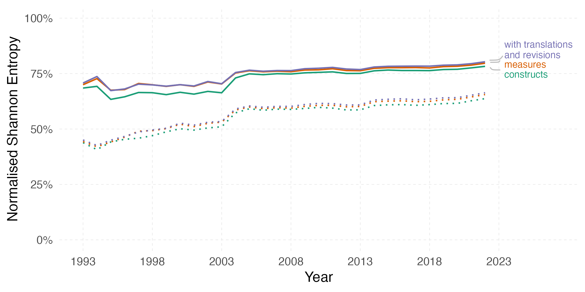

## Elson, Alsalti, Hussey, & Arslan (2023)

__Project:__ [Elson, Alsalti, Hussey, & Arslan (2023)](https://www.nature.com/articles/s44271-023-00026-9). Psychological measures aren’t toothbrushes.

__Timing__: After publication.

__Reporter:__ I found this myself.

__Type of mistake:__ Coding error that changes a conclusion in the manuscript.

__Description:__ I incorrectly implemented the normalisation of Shannon entropy. We submitted the following correction notice: A previous version incorrectly normalised Shannon entropy by the log of the number of times measures were used rather than by the number of measures that were used at least once. After correcting this mistake, we see a less pronounced increase in normalised entropy over time and overall higher levels of entropy (i.e. higher fragmentation). 

__Delay:__ After finding the error, I took some time to revisit the other code and asked Taym Alsalti to also review my code. We were working on a follow-up project. After this process concluded, we submitted a correction notice on March 20, 2024. I'm posting this note March 22, 2024.

__Solution:__ Correctly normalize by the number of measures that were used at all. See figure to see the difference (dotted lines were the incorrect, published numbers).

__Future Measures:__ More code review, always write and test a function when hand-coding a metric. Also, avoid hand-coding metrics, I evidently suck at it :-)

__Bounty:__ I found this myself, so I guess the bounty doesn't apply. I donate to Against Malaria anyway. If the sum of my errors this year exceeds what I usually donate, I'll have to consider increasing my donation.

## Holzleitner et al., 2021, preprint revision

__Project:__ [Holzleitner et al., 2021](https://www.biorxiv.org/content/10.1101/192054v4). No evidence that inbreeding avoidance is up-regulated during the ovulatory phase of the menstrual cycle.

__Timing:__ Before publication of preprint, while preparing a revision. The linked preprint still shows the earlier version, but the updated code is available at https://rubenarslan.github.io/fertility_and_kin/.

__Reporter:__ Steve Gangestad

__Type of mistake:__ Coding error that changes a number reported in the supplement

__Description:__ I ran a number of robustness checks and automated the steps. When using the `update.formula` syntax, I made a mistake, in which I removed not only the term from the regression that I wanted to remove, but also another main effect that I wanted to keep, which led to an interaction term being included without the respective main effect. 

__Delay:__ 11 days. Reported February 8, 2021, corrected February 19, 2021.

__Solution:__ I [re-added the main effect](https://github.com/rubenarslan/fertility_and_kin/commit/ecc59608cabb0f0496c00e971d392bc170080d78#diff-3a8cd097a6df9757a3139f07cce7b7fb2a937dc2650ba551f43cc05c891f17c1R206). The numbers changed only slightly, the interpretation was not affected. 

__Future Measures:__ I'm considering writing a better-tested set of functions to run my robustness checks or to look for existing well-tested solutions, to reduce the chance of errors. However, I think given a great number of robustness checks, the probability of errors goes up, and I do not want to respond by reducing the number of robustness checks. 

__Bounty:__ 10€ paid to Against Malaria 

## Arslan et al., 2018

__Project:__ [Arslan et al., 2018](https://psycnet.apa.org/record/2018-41799-001). Using 26,000 diary entries to show ovulatory changes in sexual desire and behavior.

__Timing:__ After publication.

__Reporters:__ Steve Gangestad, Dan Engber, Mike Wood

__Type of mistake:__ Several.

__Description:__ See [correction at the journal JPSP](https://psycnet.apa.org/record/2019-34417-001), [extended blog post](https://rubenarslan.github.io/posts/2019-06-20-correction-to-arslan-et-al-2019-using-26000-diary-entries-to-show-ovulatory-changes-in-sexual-desire-and-behavior/), follow-up criticism by [Gangestad & Dinh](https://www.researchgate.net/publication/341072189_Robust_Evidence_for_Moderation_of_Ovulatory_Shifts_by_Partner_Attractiveness_in_Arslan_et_al's_2020_Data), which reports an uncorrected error. We wrote [a response](https://psyarxiv.com/kjnvz/) to the follow-up critique. Please note that the publicly visible portion of the correction on PsycNet is truncated, so you actually have to download the PDF.

__Delay:__ Some immediate fixes were released via Twitter, the correction was published in June, 2019. The correction did not correct one further error, which the critical reanalysis, published online in May 2020, reported. [Our response](https://psyarxiv.com/kjnvz/) to it was published only in October 2021.

__Solution:__ See links.

__Future Measures:__ I increased the time spent on data cleaning, tried to standardize my procedures more (by using my codebook package and better naming schemes for variables). I plan to reproducibly generate figures, tables, and results paragraphs in the future to avoid transcription errors. I introduced my [bug bounty policy](bug_bounty.html) as a result.

__Bounty:__ Before BB policy.

## Arslan et al., 2017

__Project:__ [Arslan et al., 2018](http://rspb.royalsocietypublishing.org/content/285/1873/20180092.long). Relaxed selection and mutation accumulation are best studied empirically: reply to Woodley of Menie et al

__Timing:__ After publication.

__Reporter:__ Anonymous via my [Tell Me I'm Wrong form](https://tellmeimwrong.formr.org/).

__Type of mistake:__ Misquotes.

__Description:__ The journal sent us a comment on our paper to respond to, which we did in peer review and in a published response. However, the published comment was a later version than the last one we were sent. As a result, three quotes we highlight do not occur in the comment etc. 

__Delay:__ The journal only allowed the publication of a very brief [erratum](https://royalsocietypublishing.org/doi/full/10.1098/rspb.2018.1427) and massively delayed the response. Our response was published online February 2018, I heard about the misquotes almost immediately and got in touch with the journal in February. The cut erratum appeared online only August 2018.

__Solution:__ A [footnote](https://rubenarslan.github.io/posts/2018-10-26-on-making-mistakes-and-my-bug-bounty-program/#a-bad-error-culture-at-proceedings-of-the-royal-society-b) describes the ordeal. The uncut erratum is [here](https://docs.google.com/document/d/1Gka1cOd3WkLC2nu-_VeNM4jB-a2rgvW07b-Ctp7hXp4/edit?usp=sharing), the published erratum is [here](https://royalsocietypublishing.org/doi/full/10.1098/rspb.2018.1427).

__Future Measures:__ I resolved to always insist on the final version of an article I'm responding to.

__Bounty:__ Before BB policy.

## Minor stuff
To remind me who I owe beer.

https://twitter.com/rubenarslan/status/1277637487624675328

https://twitter.com/LL_Wieczorek/status/1117093149250289664

https://twitter.com/rubenarslan/status/1057365698698268672

